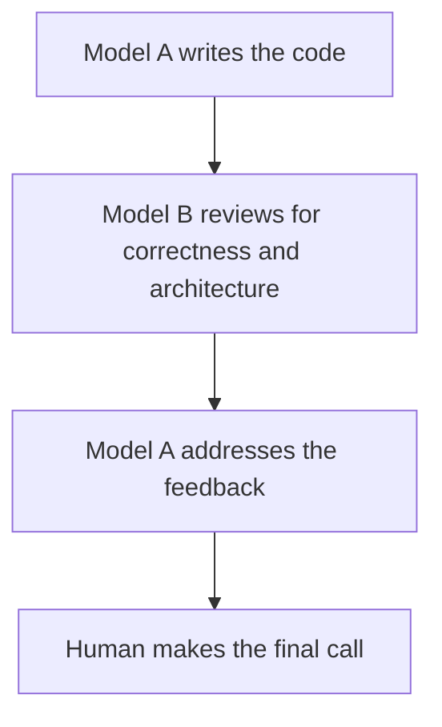

# Code Review and Quality

## Overview

Multi-dimensional code review with quality gates.
Every change gets reviewed before merge - no exceptions.
Review covers five axes:

1. [Correctness](#1---correctness)
2. [Readability](#2---readability)
3. [Architecture](#3---architecture)
4. [Security](#4---security)
5. [Performance](#5---performance)

### The Approval Standard

Approve a change when it definitely improves overall code health, even if it isn't perfect.

> [!IMPORTANT]
> Perfect code doesn't exist - **_the goal_ is continuous improvement**.

Don't block a change because it isn't exactly how you would have written it.
If it improves the codebase and follows the project's conventions, approve it.

---

## When to Use

- Before merging any PR or change
- After completing a feature implementation
- When another agent or model produced code you need to evaluate
- When refactoring existing code
- After any bugfix _(review both the fix and the regression test)_

---

## The Five-Axis Review

Every review evaluates code across these dimensions:

### 1 - Correctness

**Does the code do what it claims to do?**

- Does it match the spec or task requirements?
- Are edge cases handled _(null, empty, boundary values)_?
- Are error paths handled _(not just the happy path)_?
- Does it pass all tests? Are the tests actually testing the right things?
- Are there off-by-one errors, race conditions, or state inconsistencies?

### 2 - Readability

**Can another engineer _(or agent)_ understand this code without the author explaining it?**

- **Are names descriptive and consistent with project conventions?** _(No `temp`, `data`, `result` without context)_
- **Is the control flow straightforward** _(avoid nested ternaries, deep callbacks)_?
- **Is the code organized logically** _(related code grouped, clear module boundaries)_?
- **Are there any "clever" tricks that should be simplified?**
- **Could this be done in fewer lines?** _(1000 lines where 100 suffice is a failure)_
- **Are abstractions earning their complexity?** _(don't generalize until the third use case)_
- **Would comments help clarify non-obvious intent?** But don't comment obvious code!
- **Are there dead code artifacts**:
  - no-op variables _(`_unused`)_
  - backwards-compat shims
  - or `// removed` comments?
- **Is a new conditional bolted onto an unrelated flow?**
  That's a design smell, not a nit - push the logic into its own helper, state,
  or policy instead of tangling an existing path.
- **Do repeated conditionals on the same shape appear?**
  They signal a missing model or dispatcher.
  A _"temporary"_ branch is usually permanent debt.

### 3 - Architecture

**Does the change fit the system's design?**

- Does it follow existing patterns or introduce a new one? If new, is it justified?
- Does it maintain clean module boundaries?
- Is there a code duplication that should be shared?
- Are dependencies flowing in the right direction _(no circular dependencies)_?
- Is the abstraction level appropriate _(not overengineered, not too coupled)_?
- **Does this refactor reduce complexity or just relocate it?**
  Count the concepts a reader must hold to follow the change.
  If a _"cleaner"_ version leaves that count unchanged,
  it isn't cleaner — prefer the restructuring that makes whole branches, modes,
  or layers disappear over one that re-centralizes the same logic.
  Prefer deleting an abstraction to polishing it.
- **Is feature-specific logic leaking into a shared or general-purpose module?**
  Keep logic in its owning layer, reuse the existing canonical helper instead of a near-duplicate,
  and don't normalize architectural drift.
- **Are type boundaries explicit?**
  Question gratuitous `any`/`unknown`/optional/casts and silent fallbacks
  that paper over an unclear invariant — making the boundary explicit
  often makes the surrounding control flow simpler.

### 4 - Security

For detailed security guidance, see [`security-and-hardening` skill](../security-and-hardening/SKILL.md).

**Does the change introduce vulnerabilities?**

- Is user input validated and sanitized?
- Are secrets kept out of code, logs, and version control?
- Is authentication/authorization checked where needed?
- Are SQL queries parameterized _(no string concatenation)_?
- Are outputs encoded to prevent XSS?
- Are dependencies from trusted sources with no known vulnerabilities?
- Is data from external sources _(APIs, logs, user content, configuration files)_ treated as untrusted?
- Are external data flows validated at system boundaries before use in logic or rendering?

### 5 - Performance

For detailed profiling and optimization, see [`performance-optimization` skill](../performance-optimization/SKILL.md).

**Does the change introduce performance problems?**

- Any N+1 query patterns?
- Any unbounded loops or unconstrained data fetching?
- Any synchronous operations that should be async?
- Any unnecessary re-renders in UI components?
- Any missing pagination on list endpoints?
- Any large objects created in hot paths?

---

## Structural Remedies

When you flag a structural problem, propose the move — not just the problem.
A review that only says _"this is complex"_ leaves the author guessing.

Reach for a named restructuring:

- **Replace a chain of conditionals** with a typed model or an explicit dispatcher.
- **Collapse duplicate branches** into a single clearer flow.
- **Separate orchestration from business logic** so each reads on its own.
- **Move feature-specific logic** out of a shared module into the package that owns the concept.
- **Reuse the canonical helper** instead of a bespoke near-duplicate.
- **Make a type boundary explicit** so downstream branching disappears.
- **Delete a pass-through wrapper** that adds indirection without clarifying the API.
- **Extract a helper, or split a large file** into focused modules.

Prefer the remedy that removes moving pieces over one that spreads the same complexity around.

---

## Change Sizing

Small, focused changes are easier to review, faster to merge, and safer to deploy.

**Target these sizes**:

| Lines changed | Guidance |
| ---: | --- |
| `~100` | Good. Reviewable in one sitting. |
| `~300` | Acceptable if it's a single logical change. |
| `~1000` | Too large. Split it. |

**Watch file size, not just diff size.**
A small diff can still push a file past a healthy boundary — around `1000` _total_ lines
in a single file _(distinct from the ~1000 _changed_-lines threshold above)_ is a common inspection signal,
not a hard cap.
When a change materially grows an already-large file, ask whether to extract helpers, sub components,
or modules _first_, before piling more on.
Decompose, then add.

**What counts as _"one change"_:**
A single self-contained modification that addresses one thing, includes related tests,
and keeps the system functional after submission.
One part of a feature — not the whole feature.

**Splitting strategies when a change is too large:**

| Strategy | How | When |
| ---------- | ----- | ------ |
| **Stack** | Submit a small change, start the next one based on it | Sequential dependencies |
| **By file group** | Separate changes for groups needing different reviewers | Cross-cutting concerns |
| **Horizontal** | Create shared code/stubs first, then consumers | Layered architecture |
| **Vertical** | Break into smaller full-stack slices of the feature | Feature work |

**When large changes are acceptable:**
Complete file deletions and automated refactoring where the reviewer only needs to verify intent,
not every line.

**Separate refactoring from feature work.**
A change that refactors existing code and adds new behavior is two changes — submit them separately.
Small cleanups _(variable renaming)_ can be included at reviewer discretion.

---

## Change Descriptions

Every change needs a description that stands alone in version control history.

### First Line (Title)

Short, imperative, standalone.
_"Delete the FizzBuzz RPC"_ not _"Deleting the FizzBuzz RPC"_.
Must be informative enough that someone searching history can understand the change without reading the diff.

### Body

What is changing and why.
Include context, decisions, and reasoning not visible in the code itself.
Link to bug numbers, benchmark results, or design docs where relevant.
Acknowledge approach shortcomings when they exist.

### Anti-Patterns

- _"Fix bug"_
- _"Fix build"_
- _"Add patch"_
- _"Moving code from A to B"_
- _"Phase 1"_
- _"Add convenience functions"_

---

## Review Process

### Step 1 - Understand the Context

Before looking at code, understand the intent:

- What is this change trying to accomplish?
- What spec or task does it implement?
- What is the expected behavior change?

### Step 2 - Review the Tests First

Tests reveal intent and coverage:

- Do tests exist for the change?
- Do they test behavior (not implementation details)?
- Are edge cases covered?
- Do tests have descriptive names?
- Would the tests catch a regression if the code changed?

### Step 3 - Review the Implementation

Walk through the code with the [five axes](#the-five-axis-review) in mind:

For each file changed:

1. **Correctness**: Does this code do what the test says it should?
2. **Readability**: Can I understand this without help?
3. **Architecture**: Does this fit the system?
4. **Security**: Any vulnerabilities?
5. **Performance**: Any bottlenecks?

### Step 4 - Categorize Findings

Label every comment with its severity so the author knows what's required vs optional:

| Prefix | Meaning | Author Action |
| -------- | --------- | --------------- |
| _(no prefix)_ | Required change | Must address before merge |
| **Critical:** | Blocks merge | Security vulnerability, data loss, broken functionality |
| **Nit:** | Minor, optional | Author may ignore — formatting, style preferences |
| **Optional:** / **Consider:** | Suggestion | Worth considering but not required |
| **FYI** | Informational only | No action needed — context for future reference |

This prevents authors from treating all feedback as mandatory and wasting time on optional suggestions.

**Lead with what matters.**
Order findings by leverage: correctness and security first,
then structural regressions and missed simplifications, then everything else.
Don't bury a real issue under cosmetic nits — a few high-conviction comments beat a long list.

> [!IMPORTANT]
> If you have one structural problem and ten nits, **then the structural problem _is_ the review**.

### Step 5 - Verify the Verification

Check the author's verification story:

- What tests were run?
- Did the build pass?
- Was the change tested manually?
- Are there screenshots for UI changes?
- Is there a before/after comparison?

---

## Multi-Model Review Pattern

Use different models for different review perspectives:




This catches issues that a single model might miss — different models have different blind spots.

**Example prompt for a review agent:**

```txt
Review this code change for correctness, security, and adherence to our project conventions.
The spec says [X]. The change should [Y].
Flag any issues as Critical, Required, Optional, or Nit.
```

---

## Dead Code Hygiene

After any refactoring or implementation change, check for orphaned code:

1. Identify code that is now unreachable or unused
2. List it explicitly
3. **Ask before deleting:** _"Should I remove these now-unused elements: {list}?"_

Don't leave dead code lying around — it confuses future readers and agents.
But don't silently delete things you're not sure about.
**When in doubt, ask.**

```md
**DEAD CODE IDENTIFIED**:

1. `formatLegacyDate()` in `src/utils/date.ts` — replaced by `formatDate()`
2. `OldTaskCard` component in `src/components/` — replaced by `TaskCard`
3. `LEGACY_API_URL` constant in `src/config.ts` — no remaining references

→ Safe to remove these?
```

---

## Review Speed

Slow reviews block entire teams.
The cost of context-switching to review is less than the waiting cost imposed on others.

- **Respond within one business day** — this is the maximum, not the target
- **Ideal cadence:**
  Respond shortly after a review request arrives, unless deep in focused coding.
  A typical change should complete multiple review rounds in a single day
- **Prioritize fast individual responses** over quick final approval.
  Quick feedback reduces frustration even if multiple rounds are needed
- **Large changes:**
  Ask the author to split them rather than reviewing one massive changeset

---

## Handling Disagreements

When resolving to review disputes, apply this hierarchy:

1. **Technical facts and data** override opinions and preferences
2. **Style guides** are the absolute authority on style matters
3. **Software design** must be evaluated on engineering principles, not personal preference
4. **Codebase consistency** is acceptable if it doesn't degrade overall health

**Don't accept _"I'll clean it up later"_**.
Experience shows deferred cleanup rarely happens.
Require cleanup before submission unless it's a genuine emergency.
If surrounding issues can't be addressed in this change, require filing a bug with self-assignment.

---

## Honesty in Review

When reviewing code — whether written by you, another agent, or a human:

- **Don't rubber-stamp.**
  _"LGTM"_ without evidence of review helps no one.
- **Don't soften real issues.**
  _"This might be a minor concern"_ when it's a bug that will hit production is dishonest.
- **Quantify problems when possible.**
  _"This N+1 query will add `~50ms` per item in the list"_ is better than _"this could be slow"._
- **Push back on approaches with clear problems.**
  Sycophancy is a failure mode in reviews.
  If the implementation has issues, say so directly and propose alternatives.
- **Accept override gracefully.**
  If the author has full context and disagrees, defer to their judgment.
  Comment on code, not people — reframe personal critiques to focus on the code itself.

---

## Dependency Discipline

Part of code review is dependency review:

**Before adding any dependency:**

1. **Does the existing stack solve this?** _(Often it does.)_
2. **How large is the dependency?** _(Check bundle impact.)_
3. **Is it actively maintained?** _(Check last commit, open issues.)_
4. **Does it have known vulnerabilities?** _(`pnpm audit`)_
5. **What's the license?** _(Must be compatible with the project.)_

**Rule:** Prefer standard library and existing utilities over new dependencies.
**Every dependency is a liability.**

**Upgrading an existing dependency** is a code change like any other,
and the riskiest upgrades are the ones merged in bulk with a message like _"bump deps"_.
Review them with the same discipline:

1. **Read the changelog, not just the version number.**
   SemVer is a promise the maintainer may not have kept — a "patch" can carry a behavioral change.
   For a major bump, read the migration notes and find what breaks.
2. **One dependency per change.**
   Upgrade and merge them individually _(or in small related groups)_.
   When a bulk bump breaks the build, you've lost which package did it;
   a single-package change makes the cause obvious and the revert clean.
3. **Let the tests decide.**
   The upgrade is verified by a green suite before _and_ after, not by _"it installed"_.
   If coverage around the dependency's behavior is thin, that gap is the real finding — add a test first.
4. **Mind the transitive graph.**
   Most installed packages are ones nobody chose directly.
   Review the lockfile diff, not just `package.json`;
   a single direct bump can pull in dozens of indirect changes.
5. **Keep the lockfile honest.**
   Commit it, review its diff, and never hand-edit it.
   The lockfile is the thing that actually pins what ships.

For triaging `pnpm audit` findings and supply-chain risk _(typosquatting, compromised maintainers)_,
follow the [`security-and-hardening` skill](../security-and-hardening/SKILL.md) — this section covers the upgrade _workflow_,
that one covers the security verdict.

---

## The Review Checklist

```md
## Review: [PR/Change title]

### Context
- [ ] I understand what this change does and why

### Correctness
- [ ] Change matches spec/task requirements
- [ ] Edge cases handled
- [ ] Error paths handled
- [ ] Tests cover the change adequately

### Readability
- [ ] Names are clear and consistent
- [ ] Logic is straightforward
- [ ] No unnecessary complexity

### Architecture
- [ ] Follows existing patterns
- [ ] No unnecessary coupling or dependencies
- [ ] Appropriate abstraction level
- [ ] Refactors reduce complexity rather than relocate it
- [ ] No feature logic in shared modules; file stays within a healthy size

### Security
- [ ] No secrets in code
- [ ] Input validated at boundaries
- [ ] No injection vulnerabilities
- [ ] Auth checks in place
- [ ] External data sources treated as untrusted

### Performance
- [ ] No N+1 patterns
- [ ] No unbounded operations
- [ ] Pagination on list endpoints

### Verification
- [ ] Tests pass
- [ ] Build succeeds
- [ ] Manual verification done (if applicable)

### Verdict
- [ ] **Approve** — Ready to merge
- [ ] **Request changes** — Issues must be addressed
```

---

## See Also

- For detailed security review guidance, see [`references/security-checklist.md`](../../references/security-checklist.md)
- For performance review checks, see [`references/performance-checklist.md`](../../references/performance-checklist.md)

---

## Common Rationalizations

| Rationalization | Reality |
| --- | --- |
| _"It works, that's good enough"_ | Working code that's unreadable, insecure, or architecturally wrong creates debt that compounds. |
| _"I wrote it, so I know it's correct"_ | Authors are blind to their own assumptions. Every change benefits from another set of eyes. |
| _"We'll clean it up later"_ | Later never comes. The review is the quality gate — use it. Require cleanup before merge, not after. |
| _"AI-generated code is probably fine"_ | AI code needs more scrutiny, not less. It's confident and plausible, even when wrong. |
| _"The tests pass, so it's good"_ | Tests are necessary but not sufficient. They don't catch architecture problems, security issues, or readability concerns. |
| _"The refactor makes it cleaner"_ | Relocating complexity isn't reducing it. If the reader still holds the same number of concepts, the structure didn't improve — look for the version where branches disappear. |
| _"It's only a small addition to this file"_ | Small diffs still push files past a healthy size and bolt branches onto unrelated flows. Judge the resulting structure, not the diff size. |
| _"It's just a version bump"_ | A bump is a behavior change you didn't write. Read the changelog; SemVer doesn't guarantee no breakage. |
| _"I'll upgrade everything in one PR to save time"_ | A bulk bump that breaks the build hides which package did it. One dependency per change keeps the cause and the revert clean. |

---

## Red Flags

- PRs merged without any review
- Review that only checks if tests pass _(ignoring other axes)_
- _"LGTM"_ without evidence of actual review
- Security-sensitive changes without security-focused review
- Large PRs that are _"too big to review properly"_ <- split them!
- No regression tests with bug fix PRs
- Review comments without severity labels — makes it unclear what's required vs optional
- Accepting _"I'll fix it later"_ <— it almost never happens
- A refactor that moves code around without reducing the number of concepts a reader must hold
- A change that grows an already-large file instead of decomposing it
- New conditionals scattered into unrelated code paths _(a missing abstraction)_
- A bespoke helper that duplicates an existing canonical one, or feature logic placed in a shared module
- A bulk _"bump dependencies"_ PR with no changelog review and no per-package isolation
- A lockfile change that's hand-edited, uncommitted, or merged without reviewing its diff

---

## Verification

After review is complete:

- [ ] All Critical issues are resolved
- [ ] All Required _(no-prefix)_ changes are resolved or explicitly deferred with justification
- [ ] Tests pass
- [ ] Build succeeds
- [ ] The verification story is documented _(what changed, how it was verified)_
- [ ] Dependency upgrades were reviewed against their changelog, isolated per package,
      and verified by a green suite with the lockfile diff reviewed

**Presumptive blockers:**

Surface these and propose the simpler design for each:

- A refactor that relocates complexity instead of reducing it
- A change that pushes a file past the size boundary with no decomposition
- Feature logic added to a shared module
- A near-duplicate of an existing canonical helper
- A silent fallback that hides an unclear invariant

Escalate to Required only when the change actively makes the structure worse.
